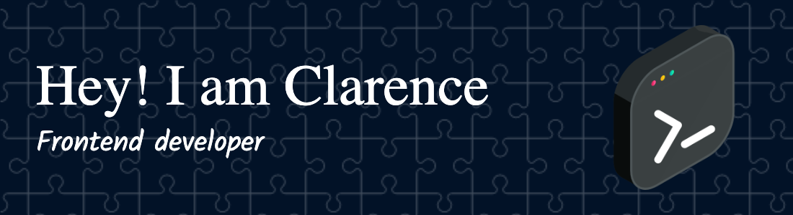

<h1 align="center">Hi 👋, I'm Clarence Colin</h1>
<h3 align="center">A passionate frontend developer from South Florida</h3>

- 🔭 I’m currently working on **Face Recognition**

- 🌱 I’m currently learning **React Native**

- 👨‍💻 All of my projects are available at [http://clarencecolin.com/](http://clarencecolin.com/)

- 📝 I regularly write articles on [https://medium.com/@clarencecolin](https://medium.com/@clarencecolin)

- 💬 Ask me about **React**

- 📫 How to reach me **clarencecolin@gmail.com**

- ⚡ Fun fact **I am a CrossFitter**

### Blogs posts
<!-- BLOG-POST-LIST:START -->
<!-- BLOG-POST-LIST:END -->

<h3 align="left">Connect with me:</h3>

<h3 align="left">Languages and Tools:</h3>

        

&nbsp;

<!--
**CCC1031/CCC1031** is a ✨ _special_ ✨ repository because its `README.md` (this file) appears on your GitHub profile.

Here are some ideas to get you started:

- 🔭 I’m currently working on ...
- 🌱 I’m currently learning ...
- 👯 I’m looking to collaborate on ...
- 🤔 I’m looking for help with ...
- 💬 Ask me about ...
- 📫 How to reach me: ...
- 😄 Pronouns: ...
- ⚡ Fun fact: ...
-->
